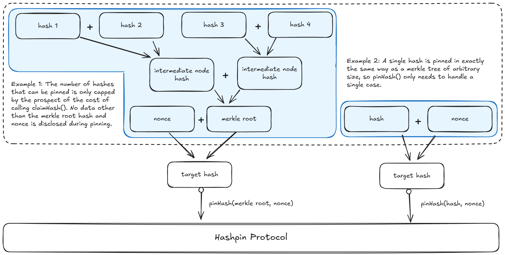
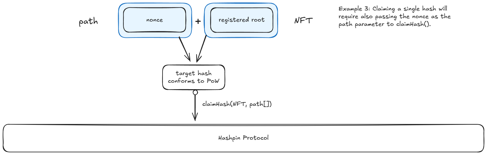
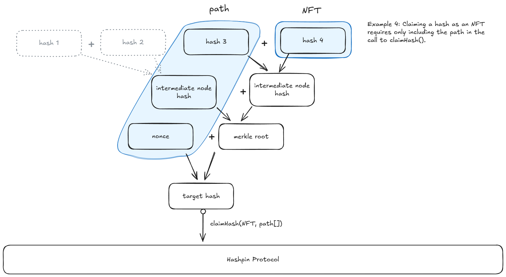
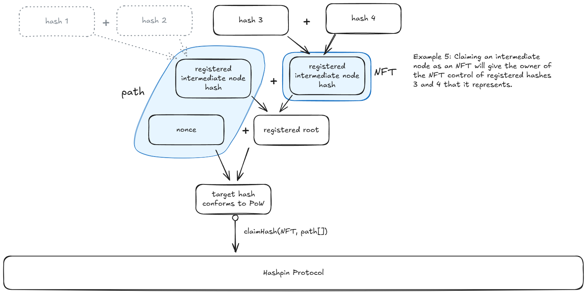

---
# Hashpin ǂ - A system for proving the existence and ownership of anything
    Author: Rex Barq
    Date: 23 March, 2025

    License Notice: Copyright © 2025 Rex Barq

    This whitepaper is free documentation: you can redistribute it and/or
    modify it under the terms of the GNU General Public License as
    published by the Free Software Foundation, either version 3 of the 
    License, or (at your option) any later version.

    This whitepaper is distributed in the hope that it will be useful,
    but WITHOUT ANY WARRANTY; without even the implied warranty of 
    MERCHANTABILITY or FITNESS FOR A PARTICULAR PURPOSE. See the GNU
    General Public License for more details.

    You should have received a copy of the GNU General Public License 
    along with this document. If not, see [https://www.gnu.org/licenses/].

--- 

## 1. Abstract

Registration of all digital content by recording its hash on a widely
recognised blockchain can solve many issues associated with verifying
authenticity without resorting to authority \[1\]. Consider the trivial
use case of proving authenticity of a photograph or video would greatly
benefit from an ability to prove that it was taken at the claimed time.

We propose a universal protocol for pinning hashes that implements the
bare minimum required to make such a protocol able to sustain its
continued existence. These components include:

1.  The ability to pin (register) a hash and associate it with a
    registrant wallet address,
2.  the ability for the registrant to claim the hash to a wallet using
    a popular NFT standard, and
3.  a utility token that is rewarded for pinning hashes and is required
    for claiming them.

The Hashpin protocol will be managed by an elected Management with
authority to spend funds collected into the Hashpin Development Fund,
funded with 2% of tokens from mining and all utility fees. Hashpin
development will be governed via a DAO, which will be set up within
the first four years after launching the protocol.

## 2. Introduction

The hashing function is a fundamental construct of the digital world.
It has found many applications in areas spanning privacy,
cryptocurrencies, data integrity, and as a universal identifier. It
could be argued that the hash is the most universal cryptographic
primitive that escapes confinement to any specific category.

Tagging a hash to a blockchain to prove existence and authenticity has
been proposed many times for many different reasons: education
certificates, NFTs, videos, files, etc., but each new use case
implementation attempt has bred a new standard in an isolated niche. It
might be argued that choosing a narrow vertical is the right way to
jumpstart such a standard. We argue that for a truly universal service,
the hashing service needs to have a narrow horizontal focus; that is, a
minimal set of features applicable to all content types and use cases.
Therefore, Hashpin is a universal crypto protocol and associated utility
token for registering any hash whatsoever, for any purpose.

To provide the possibility to use the registered hashes, the protocol
will be able to be extended by other protocols by implementing their
interfaces (ex. ERC721) \[2\].

To encourage protocol use and development Hashpin will issue a utility
token reward for pinning hashes. The token will be required to claim
hashes using other non-fungible token of the protocols, which will
ensure long term viability and an incentive for the features to be
developed.

In addition to the utility fees, the Hashpin protocol team will be
entitled to 2% of all tokens mined from pinning hashes.

## 3. Pinning (Registration) 

The main function of the protocol is to provide a
`pinHash` function for pinning (registering) any hash. Because
the hashes need to be for anything at all, there needs to be no
provision for what the hash represents and the only thing that matters
is to preserve the time the hash was pinned \[3\] and the wallet address
that pinned it.

The `pinHash` function would look something like the
following:

```
/// Pins a hash on the Hashpin protocol.
/// Requires proof-of-work to prevent spam and DoS attacks.

/// Arguments:
/// - hashToPin: The hash (or Merkle tree root) to be pinned.
/// - nonce: A value concatenated with the hash to meet the PoW difficulty.
/// Emits:
/// - HashPinned event upon successful registration.

function pinHash(bytes32 hashToPin, uint256 nonce) external {

    // Step 1: Construct the PoW candidate by concatenating hash and nonce
    bytes memory powInput = abi.encodePacked(hashToPin, nonce);]

    // Step 2: Compute the keccak256 hash of the concatenated input
    bytes32 powHash = keccak256(powInput);

    // Step 3: Check if the computed hash meets the current difficulty
    require(meetsDifficulty(powHash, currentDifficulty), \"Insufficient 
    proof-of-work\")

    // Step 4: Pin the hash with the sender\'s address and current 
    // block number
    emit HashPinned(hashToPin, msg.sender, block.number, nonce);

    // Step 5: Reward the registrant with utility tokens
    uint256 reward = calculateTokenReward(block.number);

    mintTokens(msg.sender, reward);
}
```

The difficulty parameter will be adjusted dynamically based on network
hash rate to maintain a target pinning rate.

## 4. Verification

The second important function that the protocol provides is the ability
to verify that a hash was pinned and to return the time in the form of a
block number. This is a value that most faithfully reflects the time in
terms of the blockchain. This value will need to be interpreted to give
the correct time, and this exercise will be left to the party calling
the function.

Since verification does not change the state, it will not need to be
implemented as a transaction and can be implemented in data availability
and indexing software.

## 5. Addressing high volume

The protocol must allow for pinning as many hashes as the market needs,
and so there cannot be a limit on how many hashes can be pinned per unit
time. This will be accomplished by pinning roots of merkle trees of
hashes \[4\].

For example, someone wishing to pin a large number of hashes will be
able to construct a merkle tree of arbitrary height and pin only the
root of the tree.

## 6. Throttling 

While Hashpin needs to allow for many hashes to be pinned via the
merkle tree aggregation mechanism, it must also prevent overwhelming the
host chain with transactions. This will be accomplished by requiring
that pinned hashes meet a certain target difficulty by having a number
of its starting bits be zeros.

Because of throttling, the registrant will always need to concatenate the
hash he wishes to pin with nonces to find a target hash that meets the
Proof of Work difficulty requirements.

## 7. Registration Examples 

The registration mechanism needs to be maximally simple, and so it has
to work the same way, whether a single hash is being pinned, or an
entire merkle tree. In either case, the only thing that needs to be
disclosed during registration is the  pair that constitutes
the target hash.



## 8. Speed 

The Hashpin protocol needs to be responsive, so proofs can be returned
quickly to users and so that many users can pin hashes at roughly the
same time. This means that it should be deployed on a real-time type
blockchain network.

The throughput of the protocol has to also be high enough to allow many
registrations in a short amount of time, but not so high as to overwhelm
the host chain. The throughput of Hashpin will be throttled by using
proof of work to verify that the pinned hash meets the difficulty
requirement. For this reason all pinned hashes will have to be part of a
merkle tree, where the root meets the proof of work prefix
requirement.

## 9. Ownership claim 

### Overview 

While the hash registration function will only allow for registration,
it will also pin the address that made the request. The pinning address
will be permitted to call the `claimHash` function to enable the
ERC721 interface to transfer (claim) any hash in the pinned merkle tree
to a designated address, as an NFT \[1\].

A key consideration is that it is impossible to know what hashes have
been pinned by just observing the pinned target hashes, and so one hash
may be pinned multiple times. For the purpose of practicality, the
protocol will assume that the first registrant of a hash takes
precedence over all later ones, even if it is not the first to claim. If
such a registrant tries to claim a hash that has already been claimed,
he will transfer the hash from the current owner to himself.

The claimed hash will be managed via ERC721 and be transferable just
like any other NFT without paying a transfer fee to the protocol
\[2\].

Extracting a hash will be a premium feature of Hashpin and so will
require a fee to be paid using its utility token. The fee will be
constant and will not grow in proportion to the size of the merkle proof
required to claim the hash.

### Claim Examples 

Claiming should also be simple and not concern itself about what is
being claimed, whether it's a hash or the root or an intermediate node
in the merkle tree.



The parameters to the `claimHash()` function for a single pinned hash
must also include the nonce that was used to pin it, so as to prove that
it was the base for the pinned target hash.

If we consider the nonce as the path in a merkle tree, the claimHash
function can be generalised to any merkle tree \[4\].



One case that needs to be considered specifically is what happens if
the hash claimed is not a leaf in the tree, but only an intermediate
node. From the perspective of the Hashpin protocol, this hash is
indistinguishable from any other, and so we must allow it, just as any
other.



The necessary consequence is that the claimed NFT now represents a
subtree of the pinned merkle tree that is now owned by the owner of the
NFT, and can be transferred.

### Claim Algorithm

The claimalgorithm in order to recognise the above considerations, the
algorithm needs to implement the following rules:

1.  Earliest Registration Priority:
    1.  The earliest registrant of a hash (or a Merkle root containing 
    the hash) has the ultimate claim to claim and own it.
    2.  If the hash is included in multiple pinned Merkle roots, the 
    earliest registration takes precedence.
2.  Merkle Proof Validation:
    1.  For any hash, a valid Merkle proof must be provided to link 
    the hash to a pinned root.
    2.  The function must verify this proof to confirm the hash belongs 
    to the claimed root.
3.  Ownership and Extraction:
    1.  Only the registrant of the earliest root containing the hash 
    can claim it.
    2.  If any parent node in the merkle tree has already been claimed, 
    the owner of that node is assumed to be the registrant for the 
    purpose of claiming.
    3.  If the hash has already been claimed, the earliest registrant 
    can override (usurp) the existing ownership by proving their 
    earlier registration.
4.  NFT Minting and Transfer:
    1.  Extraction results in the claimed hash becoming an ERC721 
    compliant NFT transferred to the wallet designated by the requestor.
    2.  If a requester usurps a hash that is already present in a 
    wallet as an NFT, the NFT is transferred to the usurper.
5.  Fee:
    1.  Extraction requires a fee paid in utility tokens to sustain the
    protocol.
    2.  The fee will be set by the Hashpin protocol management.

### Usurping rule 

The rule for usurping a hash may look unconventional, but it is the
only correct solution to the double registration conundrum. A registrant
is in the best position possible to assess the risk of the hash having
already been pinned by someone else, and will be able to judge the
risk.

As for a potential unaware buyer of the NFT, they will need to also
weigh the risk of usurpation, which should be easy to estimate. For
example, buying a freshly minted NFT from an unverified seller would be
risky, whereas buying one that has been around for quite a while will
carry a lower risk.

In the limit, we must consider that the first registrant could collude
with a later registrant to conduct a scam, where the NFT is sold by the
second registrant and then usurped by the first registrant. This trick
would need to be motivated by the prospect of selling the NFT again by
the first registrant. Since collusion would be obvious from the fact
that the NFT had been usurped from an unsuspecting buyer, the first
registrant should not be able to garner enough trust to sell the NFT
again, which in turn would make the whole endeavour questionable from a
game theoretical point of view.

In the end, it is in the original registrant's interest to claim high
value hashes as soon as possible or keep them secret to avoid the risk
of reputational damage. Note that as long as the original author does
not reveal the hash, no one else will have the information necessary to
pin it again anyway.

## 10. Tokenomics

### Token supply 

The Hashpin utility token will follow a perpetual, asymptotally
increasing supply (geometrically decreasing issuance) function with a
predefined halving schedule of four years, similar to Bitcoin's \[3\].
The pace of issuance will be controlled by a proof of work function,
meaning that the hashes that are pinned will have to start with enough
leading zeros to ensure a limited number of pinned hashes per unit of
time. The total maximum token supply will be fixed at 21 billion
tokens.

Tokens will be awarded as a hash reward to miners, for pinning hashes
to the protocol. Because of this, Hashpin will fund its own
security.

In the event that mining hashes becomes popular and individuals find it
difficult to generate the proof of work, we expect that hash miners will
make available online services for hash registration, where a node may
collect hash registration requests, assemble them into a merkle tree and
return the registration proof to the registrant giving them the option,
but not the obligation, to claim the hash as an NFT through them. In
this way, it will be possible to allow the largest feasible number of
registration calls without overwhelming the host chain.

### Protocol Revenue

The protocol will be able to charge fees for functionality that users
are willing to pay for. The first such functionality will be minting
NFTs from registered hashes. The price for minting one NFT will be set
by Hashpin Management and will be collected by the protocol contract
directly.

## 11. Governance

### Hashpin Development Fund (HDF)

A Protocol Tax Rate (PTR), initially set to 2%, will be set aside from
all mining rewards (i.e. 1 out of every 50 mined tokens) to fund
protocol development. This amount will be set aside in the Hashpin
Development Fund that will be managed by the Hashpin Management.

### Protocol Management

Day-to-day operation of the Hashpin Protocol shall be in the hands of
Management, who will have authority to make HDF spending decisions, and
to propose Policy Decisions.

### Election of Management 

Every halving, Hashpin Management will be up for election with anyone
staking for the duration of the last halving cycle being eligible to
vote for new management.This governance model draws from early proposals
for decentralized autonomous organizations \[5\]. This ensures that only
committed voters have a say in who leads for the next halving. These
voters eligible to elect management shall be called _Citizens of Hashpin_.

A vote of no confidence will be possible with an 80% supermajority of
voting citizens, which will trigger a new election. The 80%
supermajority is feasible in a capital-weighted system, where voting
power may concentrate among a minority of large stakeholders (e.g., 20%
of voters holding 80% of tokens). This ensures changes reflect the will
of those most invested while encouraging coordination among
citizens.

### Policy Decisions

Any update to a protocol parameter or smart contracts shall be voted on
in a policy decision by citizens. A vote on a proposal to update
protocol parameters shall be fielded by the Management or by an 80%
supermajority of the citizens' vote.

The following are protocol parameters subject to policy
decisions:

1.  Protocol Tax Rate (PTR) - as a percentage of all mined tokens, 
initially set to 2%,
2.  Management Reward Rate (MRR) - as a percentage of the funds 
collected from PTR in a given reward period, initially set to 20% or ⅕,
3.  Management Reward Period (MRP) - set as a fraction of the 
halving period, initially set to ⅛ (roughy equivalent to 6 months),
4.  Supermajority threshold - defined as a percentage of voting weight, 
initially set to 80%,
5.  Protocol smart contract upgrades, and
6.  Dividend payout to _voting citizens_.

In order for the Hashpin Protocol to foster an engaged community,
Citizens of Hashpin will be required to qualify for dividends by _voting
in at least 80% of the last 4 years' votes_. The engagement
requirement is aimed at rewarding long term commitment to the project vs
short term speculation.

### Vote Delegation

It will be possible to delegate one's policy vote to a representative
to alleviate the effort burden for voting. Delegates will be set for 1
year terms after which the delegation will have to be affirmed by the
voter to remain in force or a new one chosen, otherwise the delegation
will be automatically terminated. It will not be possible to delegate
the vote to elect management.

### Management Reward

A Management Reward (MR) sub-fund initially set to ⅕ of the value of
the Development Fund, will be used to reward the Hashpin management
board on the basis of a vote by holders of staked/locked tokens. The
voters will be asked to answer a single yes/no question, "as a
participant of Hashpin, are you better off today than you were at the
last poll?" A yes will count as a 1 and a no will count as 0. \[5\] The
weight of the vote will be proportional to the number of the voter's
staked tokens. In order to be eligible to vote, the person will need to
have staked tokens for longer than the last voting period.

The Management will be rewarded with a portion of the MR sub-fund voted
on by stakers according to the following formula:

$$
r = v^3
$$

Where:

_r_ - is the proportion of the MR sub-fund paid out to the
management, and is a value between 0 and 1.
_v_ - is the weighted average vote, which is also a value between
0 and 1.

This function works out to a relatively small reward of 12.5% of the MR
sub-fund if only half of the people think their fate as participants has
improved, and grows gradually to 50% for the MR sub-fund below a
satisfaction rating of 0.8 and grows more substantially above 0.8. The
goal is for the management to be motivated to find value-accruing
arrangements that will improve the welfare of all voters, and not just
the top 80% of wealth or just the OGs, for example.

### First Halving

During the first halving period, the Management will be the protocol's
founder, who will be able to set all policy parameters unilaterally.
This is for practical purposes, as the governance mechanism will need
time to be fully implemented before the rirst halving period ends.

## 12. [References] 

1.  Szabo, N. (1997). Formalizing and Securing Relationships on Public
    Networks. First Monday, 2(9). Retrieved from
    https://firstmonday.org/ojs/index.php/fm/article/view/548
2.  Entriken, W., Shirley, D., Evans, J., & Sachs, N. (2017). EIP-721:
    Non-Fungible Token Standard. Ethereum Improvement Proposals.
    Retrieved from https://eips.ethereum.org/EIPS/eip-721
3.  Nakamoto, S. (2008). Bitcoin: A Peer-to-Peer Electronic Cash
    System. Retrieved from https://bitcoin.org/bitcoin.pdf
4.  Merkle, R. C. (1979). Secrecy, Authentication, and Public Key
    Systems. Ph.D. dissertation, Stanford University. Retrieved from
    https://www.ralphmerkle.com/papers/Thesis1979.pdf
5.  Merkle, R. (2017 version). DAO Democracy: A Draft. Retrieved from
    https://ralphmerkle.com/papers/DAOdemocracyDraft.pdf
